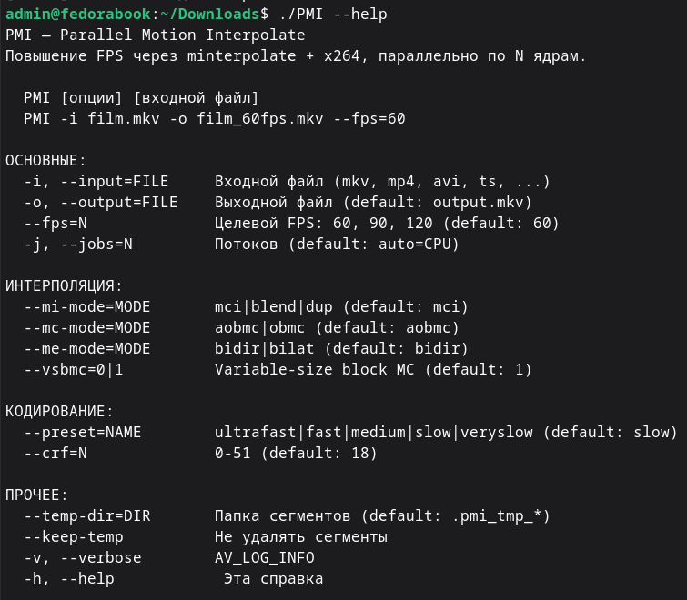

# PMI — Parallel Motion Interpolate  (v1.2)

Приложение на **Nim** со статической линковкой FFmpeg.  
Параллельно повышает FPS видео через `minterpolate`, кодирует в **x264**,
аудио и субтитры копируются без изменений.


## Интерфейс терминала


---

## Быстрая сборка (v1.2)

Начиная с v1.2 в проекте есть `config.nims` — NimScript-файл, который Nim
компилятор выполняет автоматически перед сборкой. Он сам клонирует и
собирает статический FFmpeg, если его ещё нет. Поэтому достаточно:

```bash
sudo dnf install -y nasm yasm gcc gcc-c++ make pkg-config \
                    x264-devel zlib-devel bzip2-devel xz-devel nim git

cd PMI/
nim c -d:release --threads:on PMI.nim
```

Первый запуск займёт ~10-15 минут (клонирование + сборка FFmpeg).
Повторные запуски пропускают этот шаг — `config.nims` проверяет наличие
`ffmpeg_build/lib/*.a` и, если они уже собраны, сразу переходит к линковке.

Если исходники FFmpeg уже лежат в нестандартном месте:

```bash
PMI_FFMPEG_SRC=/путь/к/FFmpeg nim c -d:release --threads:on PMI.nim
```

Ветка FFmpeg по умолчанию — `release/7.1`, зеркало GitHub
(`github.com/FFmpeg/FFmpeg`); правится в начале `config.nims`
(переменная `ffmpegBranch`).

### Альтернатива: Makefile (ручное управление шагами)

Если исходники FFmpeg уже клонированы вручную в `../FFmpeg/` и нужен
явный контроль над шагами (например, CI), можно по-прежнему пользоваться
Makefile — он не конфликтует с `config.nims`, но НЕ клонирует FFmpeg сам:

```bash
make check-deps
make build-ffmpeg    # ~10-15 мин
make build
```


## Структура

```
<родительская папка>/
├── FFmpeg/                 ← исходники FFmpeg (клонируются config.nims автоматически)
└── PMI/
    ├── PMI.nim              — оркестрация потоков (главный модуль)
    ├── config.nims          — автоклон + автосборка FFmpeg (см. «Быстрая сборка»)
    ├── Makefile              — ручная альтернатива config.nims (см. ниже)
    ├── src/
    │   ├── worker.nim       — seek → decode → minterpolate → x264
    │   ├── concat.nim       — склейка сегментов
    │   └── ffmpeg_api.nim   — Nim-обёртка над FFmpeg C API
    ├── ffmpeg_build/        ← создаётся при сборке (config.nims или make build-ffmpeg)
    │   ├── include/
    │   └── lib/  *.a
    └── PMI                  ← готовый бинарь (результат сборки)
```

`PMI.nim` подключает соседние модули как `import src/[ffmpeg_api, worker, concat]`;
сами `worker.nim`/`concat.nim` внутри `src/` импортируют `ffmpeg_api` обычным
`import ffmpeg_api` — они лежат в одной папке, путь указывать не нужно.

---

## Сборка

```bash
# Зависимости (Fedora/RHEL)
sudo dnf install -y nasm yasm gcc gcc-c++ make pkg-config \
                    x264-devel zlib-devel bzip2-devel xz-devel nim

# Проверка
make check-deps

# Шаг 1: статические .a библиотеки FFmpeg (~10-15 мин)
make build-ffmpeg

# Шаг 2: бинарь PMI
make build
```

Если FFmpeg лежит не в `../FFmpeg/`:
```bash
make build-ffmpeg FFMPEG_SRC=/другой/путь/к/FFmpeg
```

---

## Использование

```bash
./PMI -i film.mkv -o film_60fps.mkv --fps=60
./PMI -i video.mp4 -o out.mkv --fps=120 --preset=ultrafast --crf=22
./PMI film.ts --fps=90 --mi-mode=blend -o film_90.mkv
./PMI -i input.mkv -o output.mkv --fps=60 -j 4 -v
./PMI --help
```

---

## Параметры

| Параметр | Умолчание | Описание |
|---|---|---|
| `-i`, `--input` | `input.mkv` | Входной файл |
| `-o`, `--output` | `output.mkv` | Выходной файл |
| `--fps` | `60` | Целевой FPS |
| `-j`, `--jobs` | авто (CPU) | Число параллельных потоков |
| `--mi-mode` | `mci` | mci \| blend \| dup |
| `--mc-mode` | `aobmc` | aobmc \| obmc |
| `--me-mode` | `bidir` | bidir \| bilat |
| `--vsbmc` | `1` | Variable-size block MC |
| `--preset` | `slow` | x264 preset |
| `--crf` | `18` | x264 CRF (0–51) |
| `--temp-dir` | авто | Папка для временных сегментов |
| `--keep-temp` | — | Не удалять сегменты |
| `-v` | — | AV_LOG_INFO |

---

## Стиль кода (v4)

Во всех `.nim`-файлах проекта выдержаны единые соглашения:

- **Префиксный вызов функций**: `len(A)`, `find(str, ch)`, `extractFilename(path)` —
  вместо `A.len()`, `str.find(ch)`, `path.extractFilename`. Точка используется
  только для доступа к полям структур (`p.decCtx`, `job.outputFile`) и для
  простых числовых конверсий (`x.float`, `x.cint`) — это идиоматичный для Nim
  «каст», а не вызов метода.
  Исключение — `echo "текст"`, как и оговорено.
- **Блочные объявления**: два и более `const`/`let`/`var` подряд объединяются
  в один блок с отступом, а не пишутся отдельными строками с повторением
  ключевого слова.
- **Групповые `import`**: модули из одной библиотеки — через `[]` одной строкой
  (`import std/[strformat, os, math]`), локальные модули проекта — через
  запятую (`import ffmpeg_api, worker, concat`).
- Код обильно прокомментирован: пояснения к структурам данных, фазам
  flush-пайплайна, единицам измерения PTS/DTS и т. д.


### worker.nim

**Flush pipeline** — исходный код имел ошибку двойного flush энкодера.
Теперь три строго разделённые фазы:
1. `avcodec_send_packet(nil)` → drain декодера → `buffersrc_add_frame`
2. `buffersrc_add_frame(nil)` → `drainFilter()` (EOF-сигнал фильтру)
3. `avcodec_send_frame(nil)` → `flushEncoder()` (drain пакетов энкодера)

**Конвертация пикселей** — добавлен `format=pix_fmts=yuv420p` в граф если
источник не YUV420P (10-bit HEVC, VP9, AV1). Без этого x264 падал с
`AVERROR_EINVAL` при открытии кодека.

**PTS выходных кадров** — `writeFilteredFrame` использует строго монотонный
счётчик `ptsCounter` (не сырой `filtFrame.pts` из буфера фильтра): у
`minterpolate` на старте возможны дробные/дублирующиеся значения PTS,
которые ломали бы монотонность потока при прямой передаче в энкодер.
`decFrame.pts`, отправляемый в фильтрграф, при этом нормализуется из
`best_effort_timestamp` декодера — это отдельный, более ранний этап
конвейера (см. worker.nim: обработка `decFrame` перед `buffersrc`).

**pixel_aspect** — SAR берётся из `decCtx.sample_aspect_ratio` (важно для
анаморфного DVD/Blu-ray). В исходнике было захардкожено `1/1`.

**av_strdup для имён FilterInOut** — FFmpeg ожидает heap-строки которые
освобождает сам. В исходнике передавались стековые строковые литералы.

### concat.nim

**Параметры видеопотока** — берутся из первого сегмента через
`avcodec_parameters_copy`. Исходный `encCtxRef` создавался без
`avcodec_open2` и не имел корректного `extradata` (SPS/PPS).
Результат: повреждённый заголовок MKV/MP4.

**PtsClock** — тип с методом `advance()` гарантирует строгое возрастание
DTS (`newDts <= lastDts` → `newDts = lastDts + 1`). В исходнике условие
было `<= prevDts` вместо строгого `< prevDts`.

**Фильтрация потоков** — копируются только `AUDIO` и `SUBTITLE`. DATA,
ATTACHMENT и прочие типы пропускаются (в исходнике могли вызвать ошибку
контейнера при записи).

### ffmpeg_api.nim

Добавлены:
- `av_opt_set` — для `pix_fmts` на buffersink
- `av_packet_rescale_ts` — упрощает rescale при flush
- `avcodec_find_encoder` — по codec ID
- `AVOutputFormat.flags` — для проверки `AVFMT_GLOBALHEADER`
- `AV_CODEC_FLAG_GLOBAL_HEADER` как именованная константа
- `AVSEEK_FLAG_*` константы
- `getStreamFps`, `getStreamFpsRat`, `isVideoStream`, `isAudioStream`, `isSubtitleStream`

### PMI.nim

- Убрано обращение к несуществующему `vi.targetFps`
- `concatSegments` вызывается без `encCtxRef`
- `MIN_SEG_DURATION = 4.0` с (minterpolate нужен контекст кадров)
- ~~Склейка продолжается при частичных ошибках сегментов~~ — начиная с v5
  это поведение признано небезопасным и заменено на полный отказ
  (см. ниже, находка #3).

---

## v5 — исправления по статическому аудиту (report.md)

Отдельный статический аудит кода (без сборки/запуска) выявил ряд проблем;
все находки с номерами ниже соответствуют нумерации в `report.md`. Что
исправлено в этой версии:

**Critical**
- **#1** `--temp-dir` больше не удаляет произвольный существующий каталог:
  PMI удаляет temp-dir на выходе только если сам его создал в этом запуске
  (`--keep-temp` теперь не нужен для защиты уже существующих каталогов —
  они не трогаются в принципе).
- **#2** Жёсткая проверка `input == output` (по абсолютным путям) перед
  началом работы — раньше вывод мог затереть исходный файл.

**High**
- **#3** При падении хотя бы одного сегмента PMI больше не молча склеивает
  оставшиеся — весь прогон останавливается с понятной ошибкой (частичная
  склейка без учёта индексов/пропусков давала повреждённый/рассинхронный
  файл, неотличимый от успешного).
- **#4** `workerThread` теперь ловит любое `CatchableError`, а не только
  `IOError`, и всегда шлёт результат в `resultChan` — раньше необработанное
  исключение в воркере вешало главный поток в `recv` навсегда.
- **#5** `decFrame.pts` явно нормализуется из `best_effort_timestamp` перед
  отправкой в `buffersrc` — раньше это значение использовалось только для
  проверки границ сегмента, а сам кадр мог уйти в фильтр с исходным/NOPTS
  PTS, что ломало тайминг `minterpolate` на источниках с разреженными PTS.
- **#6** Убран небезопасный ранний обрыв чтения по `pkt.pts` (PTS пакета не
  монотонен при переупорядочивании B-кадров) — граница сегмента теперь
  определяется исключительно по PTS уже декодированного кадра.
- **#7** Ошибки `av_interleaved_write_frame` для аудио/субтитров больше не
  проглатываются — видимы через `ffCheckWarn`, как и в видеопути.
- **#8** Требует `docs/USAGE.md`, отсутствующего в этом срезе репозитория —
  не исправлено, см. раздел «Не покрыто этим срезом» ниже.

**Medium-High**
- **#9** CLI-парсинг: опции вида `-j 4`, `--fps 60`, `--crf 20` и т.д.
  (значение через пробел) теперь читаются так же надёжно, как `-i`/`-o` —
  раньше они молча оставались со значением по умолчанию, а следующий
  токен мог ошибочно уйти в позиционные аргументы.
- **#10** Цветовые метаданные (`colorspace`/`range`) берутся из
  `stream.codecpar` контейнера, если он их сообщает, и только при их
  отсутствии используется дефолт BT.709/tv — раньше BT.709/tv
  проставлялся всегда, независимо от реального источника (BT.601, HDR,
  full-range и т.д.).

**Medium**
- **#12** Отсутствие `fmtCtx.duration` (типично для TS/broadcast) больше
  не приводит к жёсткому отказу "видео слишком короткое": добавлены
  запасные источники длительности (`stream.duration`, оценка по
  `nb_frames`/fps), а если длительность всё равно неизвестна —
  сегментация отключается (файл идёт одним потоком) вместо ошибки.
- **#13** Добавлена валидация `--fps`, `--crf`, `--vsbmc`, `--mi-mode`,
  `--mc-mode`, `--me-mode`, `--preset` и верхняя граница `--jobs` (64) —
  раньше некорректные значения падали поздно, внутри FFmpeg/x264, а
  `--jobs` не имел разумного предела.
- **#14** `config.nims`: убрана жёсткая привязка к `nproc` (портируемое
  определение числа ядер с фолбэком на `sysctl` для macOS/BSD), команда
  `sudo dnf` больше не выполняется вслепую, если `dnf` не найден (не
  Fedora/RHEL — печатается инструкция вместо попытки), пути и имя ветки в
  shell-командах теперь в кавычках.
- **#17** Метаданные потоков (язык, title) и disposition (default/forced)
  теперь копируются в `concat.nim` вместе с параметрами кодека — раньше
  терялись.

**Low-Medium**
- **#18** Устаревшие места в README приведены в соответствие с кодом:
  описание PTS (реально используется монотонный счётчик, а не
  `filtFrame.pts` из buffersink) и `MIN_SEG_DURATION` (было 2.0 в тексте,
  4.0 в коде). Про `Makefile.windows` и структуру `docs/` — не
  исправлено, эти файлы в этом срезе репозитория отсутствуют.
- **#20** Естественно закрыто фиксом #3: раз частичный результат больше
  не склеивается молча, счётчики кадров и прогресс больше не могут
  выглядеть как «успешная полная конвертация» при повреждённом выводе.

**Performance**
- **#1** `writeFilteredFrame`/`drainFilter`/`flushEncoder` больше не
  аллоцируют `AVPacket` на каждый кадр — один `tmpPkt` переиспользуется на
  весь пайплайн сегмента (раньше — heap-аллокация/free на каждый из
  60/120 кадров в секунду).

### Не покрыто этим срезом репозитория

Часть находок ссылается на файлы, которых нет среди загруженных
(`docs/USAGE.md`, `docs/BUILD.md`, `LICENSE`, `.gitignore`,
`Makefile.windows`, содержимое `ffmpeg_build/`) — без них исправить
находки **#8** (fallback/предупреждение при MP4/MOV с несовместимыми
потоками), **#15** (машинно-специфичные `.pc`-файлы, версия FFmpeg в
`.gitignore`/вендоринге), **#16** (согласование MIT-лицензии проекта с
GPL/x264 в статической линковке) и часть **#18** (ссылки на
`Makefile.windows`) нельзя — нужны сами эти файлы.

Также намеренно не тронуты архитектурные Performance-находки **#2–8**
(overlap на коротких сегментах, статичное разбиение на сегменты без
work-stealing, порядок записи аудио/видео в `concat.nim`, повторный
`avformat_open_input`/probe на каждый сегмент/каждый temp-файл, верхняя
граница `--jobs` уже добавлена в **#13**, но авто-подбор оптимального
числа воркеров — нет) — каждая требует более широкого рефакторинга
пайплайна, который рискованно делать вслепую без возможности
скомпилировать и прогнать тесты в этой среде.

---

## Детали линковки

```
libavfilter → libavcodec → libavformat → libswscale → libswresample → libavutil
```

GNU `ld` читает `.a` слева направо — зависящая библиотека должна стоять левее.

```makefile
# ✓ Полный путь → гарантированно статика
--passL:"$(LIB)/libavcodec.a"

# ✗ Может найти системную .so
--passL:"-lavcodec"
```
